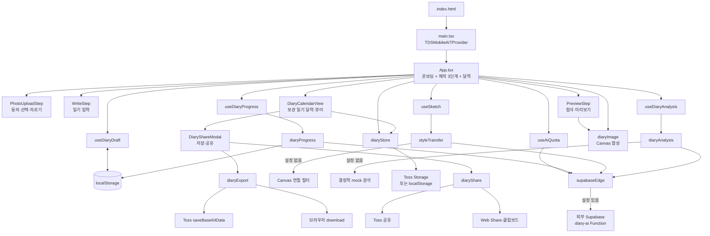
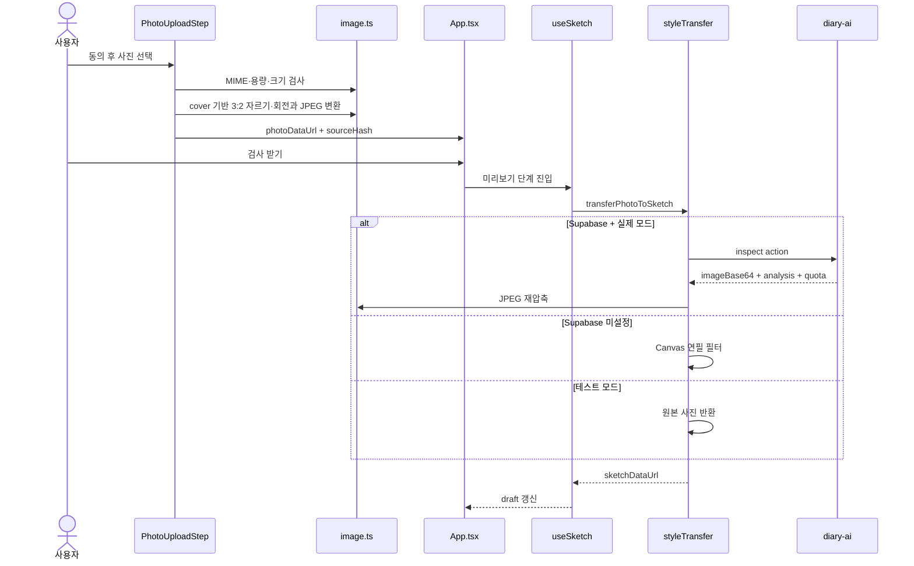
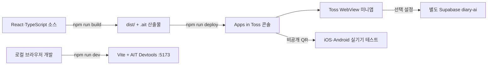

# 아키텍처

[README로 돌아가기](../README.md) · [기능 명세](./functional-specification.md) · [API 명세](./api-specification.md)

## 시스템 개요

이 프로젝트는 React 단일 페이지 WebView 앱입니다. 라우터·전역 상태 라이브러리 없이 `App.tsx`가 온보딩, 3단계 제작 흐름과 일기 달력을 조정합니다. 완성 일기는 기기 저장소에 보관하고, 별도 Supabase Edge Function과 사용량 제한 테이블이 서버 경계를 담당합니다.

사용자가 보는 주요 상태는 온보딩 → 사진 업로드 → 일기 작성 → 미리보기 → 달력·저장 일기 상세이며, 사진 처리 동의·날짜별 저장 한도·저장 및 공유는 모달 또는 다이얼로그로 분리됩니다. 실제 화면 예시는 [README 화면 갤러리](../README.md#동작-화면)에서 확인할 수 있습니다.

외부 기능은 두 경로로 분리됩니다.

- Supabase 공개 설정이 있으면 별도 배포된 `diary-ai` Edge Function에 사진 변환·일기 분석·사용량 조회를 요청합니다.
- 설정이 없으면 브라우저 Canvas 필터와 결정적 mock 분석을 사용합니다.



## 주요 컴포넌트와 책임

| 경계             | 책임                                       | 주요 파일                |
| ---------------- | ------------------------------------------ | ------------------------ |
| 진입·Provider    | React mount, Strict Mode, TDS provider     | `src/main.tsx`           |
| 화면 조정        | 온보딩, 제작 단계, 달력, 유효성, 완료 흐름 | `src/App.tsx`            |
| 화면 컴포넌트    | 사진·작성·미리보기·달력·완성 UI            | `src/components/`        |
| 도메인 상태      | `DiaryDraft`, 그림·분석·quota 비동기 상태  | `src/hooks/`             |
| 외부 경계        | Edge Function, Toss 저장·공유, 캐시        | `src/services/`          |
| 순수 계산·Canvas | 이미지 처리, 레이아웃, 첨삭, JPEG 합성     | `src/utils/`             |
| 공통 규칙        | 길이, 날씨, 브랜드, 도장                   | `src/constants/`         |
| 런타임 설정      | SDK 3.x bundle, WebView, navigation        | `apps-in-toss.config.ts` |

## 화면과 상태 흐름

`App.tsx`가 route 대신 다음 상태를 가집니다.

```text
showOnboarding=true
        ↓ 시작하기
step=upload
        ↓ 사진 있음
step=write
        ↓ 제목 + 공백이 아닌 본문
step=preview
        ↓ Canvas 합성 성공
saveDiary → calendarReveal={date, diaryId}
        ↓
step=calendar → 도장 표시 후 저장 기록 열람
```

별도 라우터 없이 화면 상태를 사용하되 `/calendar` deep link만 초기 달력 상태로 매핑합니다. 각 화면 전환은 History API에 단계 값을 넣고 토스 `backEvent`와 동기화합니다. iOS 컨테이너의 상호작용형 앞·뒤 스와이프는 `allowsBackForwardNavigationGestures: false`로 막아 페이지 상태와 네이티브 전환이 어긋나지 않게 합니다.

## 핵심 데이터 모델

```ts
interface DiaryDraft {
  photoDataUrl: string | null;
  sketchDataUrl: string | null;
  title: string;
  content: string;
  date: string;
  weather: "sunny" | "partly-cloudy" | "cloudy" | "rainy" | "stormy";
  timeOfDay: "day" | "night";
}
```

`useDiaryDraft`가 React 상태와 `localStorage`를 동기화합니다.

- key: `summer-vacation-diary:draft:v2`
- 변경 후 400ms debounce 저장
- `pagehide` 또는 문서가 hidden이 될 때 즉시 flush
- 손상된 JSON과 잘못된 필드는 기본값으로 복구
- 용량 부족 시 그림 → 사진 순으로 제외해 텍스트 저장 재시도
- 현재 `App.tsx`는 `restoreOnStart: false`이므로 앱 시작 시 저장본을 복원하지 않음

이는 데이터베이스 모델이 아니라 한 기기의 작업 사본입니다.

## 완성 일기 보관

`src/services/diaryStore.ts`는 완성한 일기를 기기에 보관하는 서비스 계층입니다. `App.tsx`가 JPEG 합성 직후 초안 ID와 AI 입력인 사진·본문의 revision hash를 `saveDiary`에 전달합니다. 같은 초안과 revision hash의 제목·날씨 변경은 기존 항목에 반영하고, 사진 또는 본문이 바뀐 버전은 새 ID로 별도 보관합니다. `DiaryCalendarView`는 목록·상세 조회, 저장·공유 모달 진입과 삭제를 제공합니다. 작업 사본인 draft와 달리 저장 실패를 `DiaryStoreError`로 알립니다.

- 저장 위치: 토스 앱에서는 Apps in Toss `Storage` 브리지, 브라우저 개발 환경에서는 localStorage. WebView의 웹 저장소는 미니앱 URL 기준으로 분리되고 OS가 정리할 수 있어 네이티브 저장소를 기본 경로로 둡니다. 그 결과 같은 토스 앱 안에서도 draft와 보관 일기의 보존 수명이 다릅니다.
- key 구조: 목록용 `summer-vacation-diary:diary-index:v1`(이미지 없는 요약 배열)과 일기별 `summer-vacation-diary:diary:v1:<id>`. 목록 조회가 이미지 바이트를 읽지 않고, 저장이 기존 일기를 다시 쓰지 않도록 나눴습니다.
- 일관성: 저장은 항목 → index 순으로 씁니다. 중간에 실패하면 화면에 보이지 않는 항목만 남고, 목록에 있는데 열 수 없는 일기는 생기지 않습니다. index에 남은 끊어진 참조는 `getDiary`가 발견할 때 정리합니다.
- 정렬은 저장이 아니라 조회 시점에 날짜·저장 시각 내림차순으로 수행합니다.
- 같은 날짜에는 서로 다른 일기를 최대 2개 저장합니다. `draftId`와 사진·본문 `revisionKey`가 모두 같은 기록만 교체하고, 사진 또는 본문이 달라진 기록은 함께 유지합니다.
- 달력은 월 단위로 이동하며 기록이 있는 날짜에 도장을 표시합니다. 같은 날 여러 일기는 이전·다음 버튼 또는 그림 영역의 좌우 스와이프로 순환하며 다른 날짜로 넘어가지 않습니다.

## 사진 처리 흐름



자르기 모달은 원본 파일을 임시 data URL로 디코딩해 `cover` 방식의 3:2 선택 영역에 맞추고, 이동·1~3배 확대·90° 회전 좌표를 원본 픽셀에 적용한 뒤 1278×852 JPEG만 초안에 저장합니다. 그림 생성과 분석은 `검사 받기`를 누른 뒤 시작합니다. 하나의 검사 context로 필요한 작업만 통합 요청하며, 실패는 자동 재시도하지 않고 원본 사진을 유지합니다.

## 일기 검사 흐름

`검사 받기`가 명시적으로 `runAnalysis()`를 호출합니다. 입력 signature는 사진과 본문의 JSON 배열입니다. 제목·날씨·낮/밤은 분석 입력이 아니므로 수정해도 기존 결과를 재사용하며 CTA를 `수정 내용 확인하기`로 바꿉니다. 사진 또는 본문이 바뀐 경우에만 `다시 검사 받기`, 아무 변경이 없으면 `미리보기로 돌아가기`를 표시합니다.

- 같은 signature의 진행 중 Promise 재사용
- 성공 결과 최근 3개 메모리 캐시
- request ID로 오래된 응답의 화면 반영 차단
- 서버 응답의 첨삭 대상이 본문 실제 부분 문자열인지 재검사
- comment가 비어 있으면 전체 응답 실패
- 비속어가 포함된 키워드·첨삭 대상 제외

실패 격리는 분석 상태 안에서 이루어져, 분석이 없어도 사용자는 그림일기를 완성할 수 있습니다.

## 통합 AI 검사 기회

사용자에게 사진 변환과 일기 분석 횟수를 따로 노출하지 않습니다.
`useAiQuota`는 서버 snapshot의 공통 `all` counter를 통합 기회의
유일한 권위값으로 사용합니다. 그림 요청 진행 중에는 sketch ledger를
`all` 사용량에 선반영하고, 통합 잔여량이 0이면 두 작업을 함께 선차단합니다.

클라이언트는 필요한 그림·분석 작업을 하나의 `inspect` 요청으로 모읍니다.
Edge Function은 사용자 충전 기회와 IP를 요청당 한 번 예약하고 실제 실행할 sketch·analyze service counter만 증가시키는 `consume_diary_ai_inspection_quota_v2` RPC를 호출합니다. 사용자 기회는 최초 2개이며 매일 09:00 KST에 1개를 충전하되 최대 2개까지만 보유합니다. 잔여량이 2개 미만이면 `grant_diary_ai_ad_reward_v2`가 새로운 광고 영수증당 1개를 추가하며 일일 횟수 제한은 없습니다. 저장소 SQL은 transaction advisory lock과 사용자 행 잠금으로 같은 식별자의 동시 요청을 직렬화하고 영수증 기본 키로 중복 callback을 막습니다.

## 연속 기록 흐름

`useDiaryProgress`는 앱 mount와 `visibilitychange` 복귀 시 방문을 기록합니다. `diaryProgress` 서비스가 Supabase 설정 여부에 따라 Edge Function 또는 localStorage 구현을 선택하고, UI는 동일한 snapshot만 사용합니다.

일기 완성 시 순서는 `JPEG 합성 → 기기 일기 저장 → progress-complete`입니다. 따라서 진행 서버 장애가 사용자의 완성 일기를 잃게 만들지 않습니다. 완료 요청이 실패하면 한국 날짜를 pending marker로 남겨 같은 날 다음 앱 복귀에 재시도하고, 날짜가 바뀐 marker는 폐기합니다.

연속 일수는 `diary_activity_days`의 오늘부터 이어진 날짜만 계산합니다. 최고 기록은 모델에 없습니다. 업로드 카드에는 오늘의 도장 상태와 현재 연속 일수를 AI 잔여량 위에 표시하고, 달력 요약 카드에는 현재 연속 일수와 누적 작성일을 표시합니다. 완성 후 새 특별 마일스톤이 있으면 저장 기록 공개 애니메이션 뒤 축하 모달을 엽니다.

## 완성 이미지 흐름

미리보기 DOM과 JPEG Canvas는 `diaryFrameLayout.ts`의 1080×1350 좌표를 공유합니다.

1. 프레임·폰트·날씨·첨삭·도장 이미지를 로드합니다.
2. 날짜·날씨·제목·사진·13×5 본문·한마디를 Canvas에 그립니다.
3. 외부 생성 결과가 있으면 `AI 생성 콘텐츠` watermark를 표시합니다.
4. `image/jpeg` data URL을 일기 달력에 보관한 뒤 오늘의 완료를 기록하고, 두 작업의 결과를 구분한 토스트를 표시합니다.
5. 저장 날짜의 도장 애니메이션을 보여준 뒤 상세 뷰어를 엽니다.
6. 상세 뷰어의 `저장 및 공유` 모달에서 같은 data URL을 토스 저장 또는 브라우저 다운로드에 사용합니다.

Canvas 합성과 외부 요청은 서로 분리되어 있어 Edge Function이 실패해도 원본 사진으로 합성할 수 있습니다.

미리보기 하단 작업 바는 처리 중에도 mount 상태를 유지합니다. `App.tsx`가 진입 시 처리 잠금을 먼저 설정하고, `PreviewStep`이 카드·첨삭·도장 공개 애니메이션 종료를 알린 뒤 잠금을 해제하므로 사용자가 완성되지 않은 프레임을 저장하는 것을 막습니다. `prefers-reduced-motion: reduce`에서는 애니메이션 대기 없이 해제합니다. 첨삭 체크·별표는 투명도와 원본 질감을 보존하는 PNG 자산을 사용합니다.

## 외부 서비스와 저장소

| 대상                | 전송 또는 저장 데이터                                                       | 경계                              |
| ------------------- | --------------------------------------------------------------------------- | --------------------------------- |
| Supabase `diary-ai` | inspect·quota와 익명 hash 기반 방문·완료 action                             | `supabaseEdge.ts`                 |
| Supabase PostgreSQL | AI 잔여 기회, 요청 횟수, 익명 사용자 방문일·활동일·마일스톤 정의            | credit·rate-limit·progress tables |
| OpenAI              | 분석은 Chat Completions, 그림은 Images Edits로 사진·본문 전송               | `supabase/diary-ai/index.ts`      |
| Apps in Toss        | 익명 key 조회, JPEG 저장, 앱 공유 링크와 메시지, 완성 일기 보관(`Storage`)  | web-framework runtime API         |
| localStorage        | draft, quota/progress snapshot, 브라우저 ID, 완성 일기와 progress 대체 경로 | 기기 내                           |
| 메모리              | 분석 캐시, 그림 캐시, 진행 요청 ledger, 완성 JPEG                           | 현재 앱 실행                      |

## 인증·인가

- 사용자 계정, login session, 역할, route guard가 없습니다.
- Supabase 호출에는 공개 publishable key를 `apikey` header로 보냅니다.
- Toss 익명 key 또는 무작위 브라우저 UUID는 `x-diary-client-id`로 보내지만 인증 수단이 아니라 남용 제한용 식별 힌트입니다.
- 제공된 Edge Function은 client ID·IP를 salt 포함 SHA-256으로 hash하고, 한국 외 확인된 국가를 차단한 뒤 DB RPC로 quota를 예약합니다. Supabase gateway의 JWT 검증 설정과 table/RPC role grant는 스냅샷만으로 확인할 수 없습니다.

## 비동기 처리와 실패 격리

| 작업        | timeout               | 중복 방지                            | 실패 후 동작                    |
| ----------- | --------------------- | ------------------------------------ | ------------------------------- |
| quota 조회  | 10초                  | 앱 시작 1회, 후속 응답 snapshot 사용 | 사용량 UI만 unknown             |
| 진행 기록   | 10초                  | DB 날짜 PK·앱 foreground 갱신        | 일기는 유지, 당일 완료 재시도   |
| 일기 분석   | 30초                  | signature별 Promise·결과 캐시        | 첨삭 없는 미리보기, 선택 재시도 |
| 그림 생성   | 120초                 | 사진 캐시·진행 ledger                | 원본 사진, 선택 재시도          |
| Canvas 합성 | 별도 timeout 없음     | 완성 버튼의 `saving` 상태            | 토스트 재시도                   |
| 보관        | SDK/브라우저 API 의존 | 서비스 직렬 queue·AI 입력 hash 교체  | 토스트 또는 달력 오류 메시지    |
| 저장·공유   | SDK/브라우저 API 의존 | 모달·뷰어의 busy 상태                | 현재 화면의 오류 메시지         |

클라이언트 timeout은 서버 실행 취소를 보장하지 않습니다. 분석 timeout 후 quota를 다시 조회하고, 그림은 확인 불가 결과로 ledger를 해제한 뒤 snapshot을 갱신할 수 있도록 구성되어 있습니다.

## 배포 구조



`package.json`의 build는 `vite build && ait build`이고 `apps-in-toss.config.ts`의 `webBundleDir`은 `dist`입니다. GitHub Actions에는 PR merge Discord 알림만 있고 빌드·테스트·배포 workflow는 없습니다.

## 확인된 기술 선택

- **WebView SDK 3.1.1:** SDK 2.x Origin을 유지하고 AIT Devtools 및 콘솔 QR 테스트를 사용하는 안정 버전으로 고정
- **라우터 없음:** deep link 없는 엄격한 wizard라 의존성 추가 이점이 없다는 `App.tsx` 주석
- **HTML 파일 입력:** 브라우저와 Toss WebView 모두 동작하고 Granite 사진 권한이 필요 없다는 `PhotoUploadStep.tsx` 주석
- **data URL + localStorage:** 백엔드 없이 작업 사본을 유지하되 JPEG 압축과 단계적 용량 저하로 quota 오류를 완화
- **공유 링크만 전달:** 완성 사진을 public URL로 업로드하는 서버가 없어 이미지가 아닌 앱 링크를 공유

## 알려진 제약

- 시작 시 저장된 draft를 복원하지 않습니다.
- 2026-08-30 운영 Edge Function v136과 DB v2 RPC가 저장소 source와 일치함을 확인했습니다. 이후 배포도 동일한 source 대조와 quota·광고 smoke test가 필요합니다.
- rate-limit 정리 RPC는 제공되지만 실제 주기 실행 schedule과 hash 보존 기간은 운영 설정이 필요합니다.
- 자동 테스트와 CI 품질 gate가 없습니다.
- 계정 동기화, 클라우드 백업, PDF 내보내기가 없습니다.
- 브라우저 저장·공유 fallback과 Toss 실제 동작은 각각 별도 환경 검증이 필요합니다.

## 관련 문서

- [정보구조](./information-architecture.md)
- [API 명세](./api-specification.md)
- [ERD](./erd.md)
- [보안·데이터 처리](./security.md)
- [배포](./deployment.md)
