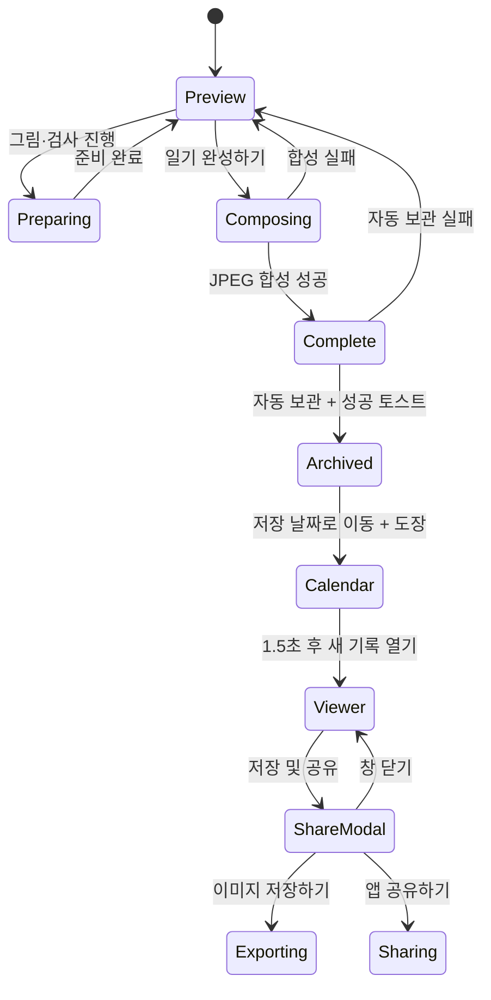

# 완성·보관 UX 명세

[README로 돌아가기](../README.md) · [기능 명세](./functional-specification.md) · [정보구조](./information-architecture.md)

## 범위

이 문서는 현재 구현된 `일기 완성하기` 이후의 JPEG 합성, 자동 보관, 파일 저장, 앱 공유와 새 일기 흐름을 설명합니다.

근거 파일:

- `src/App.tsx`
- `src/components/DiaryShareModal.tsx`
- `src/components/DiaryCalendarView.tsx`
- `src/services/diaryStore.ts`
- `src/services/diaryExport.ts`
- `src/services/diaryShare.ts`
- `src/utils/diaryImage.ts`

## 완료의 의미

앱에서 사용하는 완료 상태는 서로 다릅니다.

| 상태          | 의미                                              | 사용자에게 보이는 결과                 |
| ------------- | ------------------------------------------------- | -------------------------------------- |
| 미리보기 준비 | 그림 변환·분석·처리 애니메이션이 끝남             | `일기 완성하기` 활성화                 |
| 이미지 완성   | `composeDiaryImage()`가 JPEG data URL 생성        | 달력 자동 보관 시도                    |
| 달력 보관     | `saveDiary()`가 기기 저장소에 record와 index 저장 | 오늘의 도장 기록 후 결과별 토스트 표시 |
| 파일 저장     | 사용자가 `이미지 저장하기` 실행                   | 토스 저장 화면 또는 브라우저 다운로드  |
| 앱 공유       | 사용자가 `앱 공유하기` 실행                       | 앱 소개 문구와 미니앱 링크 공유        |

이미지 완성과 파일 저장은 같은 동작이 아닙니다. 완성 이미지는 먼저 달력에 보관되며, 사진 앱이나 다운로드 폴더에 별도로 보관하려면 상세 뷰어의 `저장 및 공유`에서 `이미지 저장하기`를 눌러야 합니다.

## 상태 흐름

## 미완료 결과 처리

`일기 완성하기` 시 그림 또는 분석 상태에 따라 다음 확인을 거칩니다.

- 처리 애니메이션이 끝난 미리보기에는 `일기 완성하기`를 눌러야 달력에 저장된다는 안내를 표시합니다.
- 그림·분석 처리 애니메이션 중에도 하단의 `일기 수정`과 `일기 완성하기` 위치는 유지하되 두 버튼을 비활성화합니다.
- 카드·첨삭·도장 공개 애니메이션이 끝난 뒤 버튼을 활성화하며, 동작 줄이기 설정에서는 애니메이션 대기 없이 활성화합니다.
- AI 사용량이 소진되어 실행할 작업이 없으면 처리 애니메이션을 생략합니다.
- 그림이나 한마디가 생성 중이면 기다리거나 현재 상태로 저장할 수 있습니다.
- 재시도 가능한 분석 오류가 있으면 다시 시도하거나 첨삭 없이 저장할 수 있습니다.
- 아직 검사를 실행하지 않았고 실행 가능한 상태라면 검사 받기 또는 그대로 저장을 선택할 수 있습니다.
- 그림 오류는 원본 사진으로 대체합니다.
- AI 사용량 또는 지역 제한이 있어도 원본 사진과 작성한 글로 JPEG를 완성할 수 있습니다.

## JPEG 합성

- 출력 크기: 1080×1350
- 출력 형식: JPEG data URL
- 파일명: `summer-diary-YYYY-MM-DD-HHMMSS.jpg`
- 입력: 그림 또는 원본 사진, 제목, 본문, 날짜, 날씨, 분석 결과, AI 생성 여부
- 미리보기에서 이미 렌더링한 입력과 완성 입력이 같으면 해당 결과를 재사용합니다.
- 외부 생성 결과가 하나라도 포함되면 `AI 생성 콘텐츠` 워터마크를 표시합니다.
- 합성 중 CTA는 `완성 중…`, `disabled`, `aria-busy` 상태를 사용합니다.
- 합성 실패 시 미리보기를 유지하고 토스트의 `다시 시도`를 제공합니다.

## 자동 보관

JPEG 합성 성공 직후 앱은 같은 이미지를 일기 달력에 자동 보관합니다. 보관에 성공하면 해당 달력으로 이동해 날짜에 도장이 찍히는 모습을 충분히 보여준 뒤 새 기록을 자동으로 열고, 보관에 실패하면 미리보기를 유지합니다.

- 토스: Apps in Toss `Storage`
- 일반 브라우저: `localStorage`
- 날짜별 최대 2개
- 보관 날짜는 초안을 만든 시점의 기기 현지 날짜이며 사용자가 바꿀 수 없음
- 같은 초안 ID와 사진·본문 revision hash가 같으면 제목·날씨 변경을 기존 항목에 반영
- 같은 초안이라도 사진 또는 본문이 달라지면 새 ID의 별도 항목으로 저장
- 이전 버전의 동일 날짜·동일 이미지는 새 초안 ID 모델로 교체
- index에는 이미지 없는 요약만 저장하고, JPEG는 일기별 key에 저장
- 보관과 오늘의 도장 기록 성공 시 `일기와 오늘의 도장을 저장했어요! (현재 개수/2)` 토스트 표시
- 보관은 성공하고 도장 기록만 실패하면 `일기는 저장했지만 오늘의 도장을 확인하지 못했어요.` 표시
- 날짜별 2개 한도에 걸리면 미리보기에서 닫기·`일기장 보기` 다이얼로그를 표시하고, 일기장에서 기존 기록을 삭제한 뒤 미리보기로 돌아와 다시 완성할 수 있음
- 보관 성공 시 저장 날짜가 포함된 달로 이동하고 1.5초 뒤 방금 저장한 기록을 자동으로 열기
- 보관 실패는 토스트로 알리되 미리보기는 유지
- 보관 데이터는 서버나 다른 기기와 동기화되지 않음

## 저장·공유 모달

저장·공유 모달은 달력 상세 뷰어의 `저장 및 공유`를 누르면 열리며 다음 요소를 제공합니다.

1. 제목 `저장 및 공유`
2. 설명 `이미지를 기기에 저장하거나 앱 링크를 공유할 수 있어요.`
3. 한 줄에 같은 너비로 배치한 `앱 공유하기`, `이미지 저장하기`(오른쪽 강조 버튼)
4. 그 아래 한 줄 전체 너비의 크림색 보조 톤을 적용한 `창 닫기`

저장된 일기 이미지는 바로 뒤의 상세 뷰어에서 이미 확인할 수 있으므로 모달 안에서는 다시 표시하지 않습니다.

모달 진입 시 완료 제목으로 포커스를 옮기고 제목·설명을 dialog에 연결합니다. 저장·공유 중에는 중복 실행을 막고, 오류가 나면 모달을 유지한 채 `role="alert"` 메시지를 표시합니다.

## 저장과 공유

### 이미지 저장하기

- 토스에서는 JPEG Base64를 `saveBase64Data`에 전달합니다.
- 일반 브라우저에서는 `<a download>`로 다운로드를 시작합니다.
- 저장 API 또는 다운로드 시작 실패만 오류로 표시합니다.

### 앱 공유하기

- 토스에서는 `intoss://summer-vacation-diary`의 공유 링크를 만들어 공유창을 엽니다.
- 브라우저에서는 Web Share를 사용하고, 미지원 시 현재 URL을 클립보드에 복사합니다.
- 완성 JPEG는 앱 공유 payload에 포함하지 않습니다.
- 사용자가 공유창을 닫거나 취소한 경우 오류로 표시하지 않습니다.

### 일기 달력에서 저장 및 공유하기

달력 상세 뷰어의 `저장 및 공유`는 저장·공유 모달을 엽니다. 모달에서 보관한 JPEG를 기기에 저장하거나 앱 진입 링크를 공유할 수 있습니다.

## 수동 회귀 확인

- [ ] 처리 중에는 `선생님 검사 중…`, 합성 중에는 `완성 중…`이 표시된다.
- [ ] 처리·공개 중 하단 버튼 위치가 유지되고 비활성화되며 도장 또는 카드 공개가 끝난 뒤 활성화된다.
- [ ] 동작 줄이기 설정에서는 공개 애니메이션 때문에 버튼 잠금이 남지 않는다.
- [ ] 그림·분석 진행 중 저장 선택지가 실제 진행 항목만 설명한다.
- [ ] 원본 대체 또는 첨삭 없는 상태로도 명시적 선택 후 완성할 수 있다.
- [ ] 미리보기와 1080×1350 JPEG의 사진·본문·날짜·날씨·첨삭·도장이 일치한다.
- [ ] 상세 뷰어의 `저장 및 공유`를 눌렀을 때만 저장·공유 모달이 열린다.
- [ ] 저장·공유 모달에는 이미지 미리보기가 없고 저장·공유 설명과 버튼만 표시된다.
- [ ] 저장·공유 모달에서 하늘색 앱 공유는 왼쪽, 빨간 이미지 저장은 오른쪽에 반씩 표시되고, 그 아래 창 닫기가 아이콘 없는 크림색 공통 버튼 스타일로 표시된다.
- [ ] 저장·공유 모달의 저장·앱 공유·창 닫기가 동작한다.
- [ ] 자동 보관 실패 시 달력이나 저장·공유 모달로 이동하지 않고 미리보기를 유지한다.
- [ ] 자동 보관과 도장 기록 성공 직후 `일기와 오늘의 도장을 저장했어요! (현재 개수/2)` 토스트가 한 번 표시된다.
- [ ] 도장 기록 실패 시 완성 일기는 유지되고 도장 확인 실패 토스트가 표시된다.
- [ ] 미리보기 저장 시 하루 2개 한도에 걸리면 일기장으로 이동해 삭제한 뒤 같은 미리보기로 돌아올 수 있다.
- [ ] 자동 보관 성공 직후 해당 날짜에 도장이 찍히고, 1.5초 뒤 방금 저장한 기록이 자동으로 열린다.
- [ ] 완성 후 달력의 `새 일기 쓰기`는 업로드로 이동하고, 한도 안내에서 진입한 달력은 작성 또는 미리보기로 정확히 돌아간다.
- [ ] 같은 초안의 사진·본문은 유지하고 제목·날씨만 바꿔 다시 저장하면 기존 항목을 교체하고 같은 날짜는 최대 2개로 제한된다.
- [ ] 같은 초안의 사진 또는 본문을 수정해 다시 저장하면 같은 날짜에 서로 다른 기록이 남는다.
- [ ] 새 일기 시작 후에도 기존 일기 달력 기록은 남는다.
