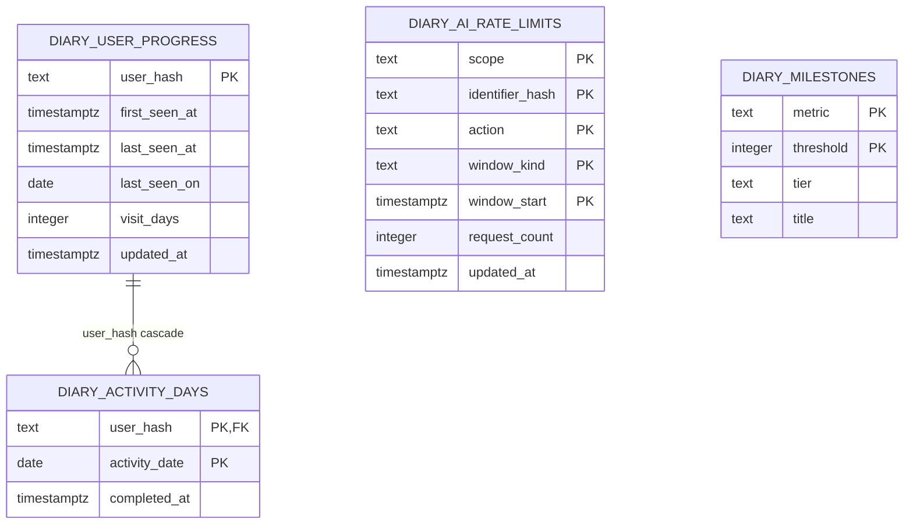

# 데이터 모델과 Supabase SQL

[README로 돌아가기](../README.md) · [API 명세](./api-specification.md) · [보안·데이터 처리](./security.md)

## 기준 파일

새 Supabase 프로젝트의 SQL Editor에서 [`supabase/sql/001_app_database.sql`](../supabase/sql/001_app_database.sql)을 한 번 실행하면 AI 사용량 제한과 연속 일기 기능에 필요한 table, index, private helper, public RPC, RLS·권한을 함께 설치합니다. 기존 `diary_ai_rate_limits`가 있어도 `create table if not exists`를 사용하므로 행을 삭제하지 않습니다.

이 SQL은 완성 일기 원문이나 이미지를 서버에 저장하지 않습니다. 일기 데이터는 기기 `Storage`에 남고, 서버에는 salt로 hash한 익명 식별자와 날짜별 활동만 남습니다.

## ERD



`diary_milestones`는 사용자별 달성 행을 저장하는 table이 아니라 version 관리되는 달성 기준입니다. 해당 날짜가 처음 적립될 때 현재 연속·누적 값과 일치하는 기준만 응답하므로 별도 “받음” table이 필요하지 않습니다.

## 기기 보관 모델

완성 일기 본문과 이미지는 서버가 아니라 기기 저장소에 남습니다. 기기 저장소는 관계형 데이터베이스가 아니므로 위 ERD에 포함하지 않습니다. 논리 구조는 다음과 같습니다.

```text
diary-index:v1
└── DiarySummary[]: id, draftId, revisionKey, date, savedAt, title, weather

diary:v1:<id>
└── DiaryRecord: summary 필드 + content, imageDataUrl, includesAiGeneratedContent
```

- 하나의 summary는 같은 `id`의 record 하나를 가리킵니다.
- `date`는 초안을 만든 시점의 기기 현지 날짜로 확정되며 사용자가 바꿀 수 없습니다.
- `draftId`와 사진·본문의 `revisionKey`가 같은 일기는 제목·날씨를 바꿔 다시 저장해도 기존 항목을 대체해 하나만 유지합니다. 같은 `draftId`라도 사진 또는 본문이 달라지면 별도 항목으로 저장합니다. 이전 버전에서 저장해 `revisionKey`가 없는 기록도 계속 읽되, 사진 일치 여부를 확정할 수 없어 다른 기록과 자동 병합하지 않습니다.
- 같은 날짜에는 유효한 record를 최대 2개 저장합니다.
- 저장 순서는 record → index이며, 조회 중 끊어진 index 참조를 정리합니다.
- 사용자 계정이나 서버 foreign key가 없어 다른 기기와 동기화되지 않습니다.

기기의 `date`와 서버 활동일은 별개입니다. 서버는 아래 [날짜와 연속 계산](#날짜와-연속-계산)처럼 한국 날짜 기준 적립만 사용하고, 기기에 저장된 일기 `date`는 전달받지 않습니다.

## table 책임

| table                   | 책임                                              | 주요 무결성                                                        |
| ----------------------- | ------------------------------------------------- | ------------------------------------------------------------------ |
| `diary_ai_user_credits` | 사용자별 AI 검사 잔여량과 마지막 충전 경계        | SHA-256 PK, 잔여량 0~2, UTC day 경계                               |
| `diary_ai_rate_limits`  | IP·서비스 scope·hash·action·window별 AI 요청 횟수 | 복합 PK, 허용값 check, 0 이상 count                                |
| `diary_user_progress`   | 첫/최근 방문과 서로 다른 방문일 수                | SHA-256 형식 PK, `visit_days >= 1`                                 |
| `diary_activity_days`   | 실제 앱 방문 당일 완성 여부                       | `(user_hash, activity_date)` PK로 하루 1회, 사용자 삭제 시 cascade |
| `diary_milestones`      | 연속·누적 기준과 표시 문구                        | `(metric, threshold)` PK, tier check                               |

## public RPC

table 직접 권한은 모두 회수하고 다음 함수만 `service_role`에 실행 권한을 줍니다.

| RPC                                    | 역할                                                                         |
| -------------------------------------- | ---------------------------------------------------------------------------- |
| `consume_diary_ai_inspection_quota_v2` | 충전을 반영하고 사용자 기회·IP·서비스 counter를 한 transaction에서 검사·예약 |
| `refund_diary_ai_inspection_quota_v2`  | 환불 가능한 실패의 사용자 기회·보호 counter 반환                             |
| `read_diary_ai_inspection_quota_v2`    | 충전을 반영하는 비차감 quota snapshot 조회                                   |
| `cleanup_diary_ai_rate_limits`         | 기준 시각보다 오래된 rate-limit 행 정리                                      |
| `record_diary_app_visit`               | 한국 날짜 방문을 멱등 반영하고 snapshot 반환                                 |
| `read_diary_progress`                  | 현재 연속 일수와 누적 작성일 조회                                            |
| `record_diary_completion`              | 오늘 활동일을 멱등 적립하고 신규 마일스톤 반환                               |
| `delete_diary_progress`                | 익명 사용자 진행 데이터 삭제                                                 |

quota와 progress 쓰기는 user hash 기반 PostgreSQL advisory transaction lock을 사용합니다. 같은 사용자의 동시 완료 요청은 직렬화되고, 활동일 복합 PK가 최종 중복 적립을 막습니다.

## 날짜와 연속 계산

- 활동 기준일은 `timezone('Asia/Seoul', clock_timestamp())::date`입니다.
- 일기 내용에 입력한 날짜는 서버에 전달하지 않으며 적립 계산에 쓰지 않습니다.
- `currentStreak`은 오늘 활동이 있으면 오늘부터, 오늘 활동이 없으면 어제부터 역순으로 이어진 활동일을 셉니다.
- 최고 기록 column과 계산 함수는 두지 않습니다.
- 방문일과 활동일을 분리해 “앱을 열었지만 일기를 완성하지 않은 날”은 방문 반응에만 쓰고 연속 일수에는 넣지 않습니다.

## 권한과 운영

- 네 public table 모두 RLS가 활성화됩니다.
- `anon`, `authenticated`는 table·RPC 직접 권한이 없습니다.
- Edge Function이 service role로만 RPC를 호출합니다.
- `cleanup_diary_ai_rate_limits`는 설치만 되므로 운영 환경에서 cron schedule과 보존 기간을 정해야 합니다.
- salt를 바꾸면 기존 hash와 새 hash가 연결되지 않아 사용자 진행이 새로 시작됩니다. rotation 전에 제품 정책을 결정해야 합니다.

## 설치 확인

SQL Editor 실행 뒤 아래 query로 객체를 확인할 수 있습니다.

```sql
select table_name
from information_schema.tables
where table_schema = 'public'
  and table_name like 'diary_%'
order by table_name;

select routine_name
from information_schema.routines
where routine_schema = 'public'
  and routine_name like '%diary%'
order by routine_name;
```

## 관련 문서

- [API 명세](./api-specification.md)
- [기능 명세](./functional-specification.md)
- [배포](./deployment.md)
- [보안·데이터 처리](./security.md)
