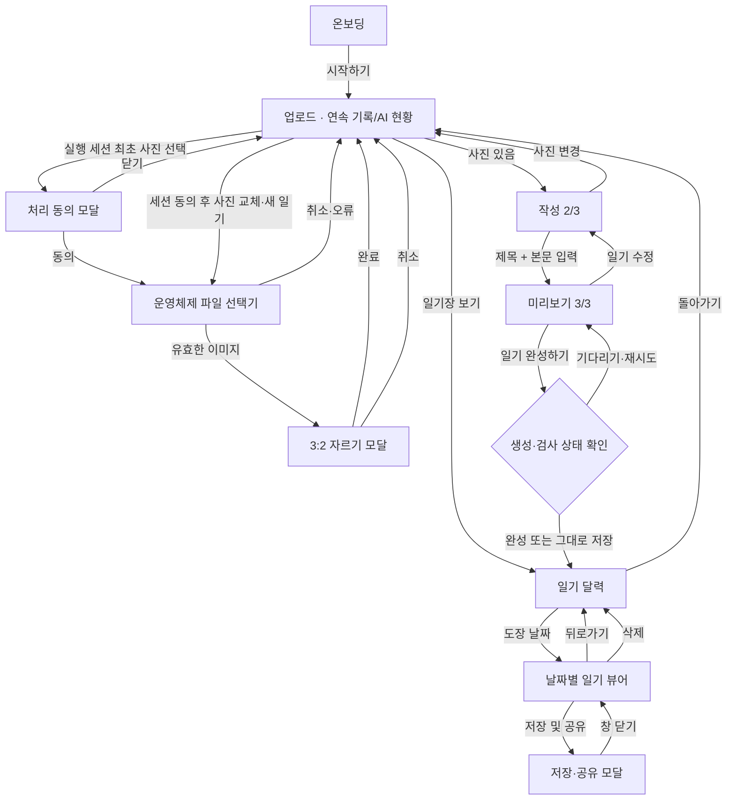

# 정보구조

[README로 돌아가기](../README.md) · [기능 명세](./functional-specification.md) · [아키텍처](./architecture.md)

## 구조 요약

앱에는 URL 라우터와 전역 메뉴가 없습니다. `src/App.tsx`의 React 상태가 온보딩, `upload → write → preview` 제작 단계와 독립 목적지인 `calendar`를 전환합니다. 자르기·동의·저장 및 공유·보관 일기 상세는 현재 화면 위에 오버레이로 열립니다.

현재 동작 화면은 [README의 화면 갤러리](../README.md#동작-화면)와 대응합니다. 업로드의 오늘 도장·연속 작성 상태, 날짜별 기록이 가득 찬 경우의 안내 모달, 저장 일기 상세, 저장·공유 모달, 연속·누적 기록 카드가 있는 달력 화면도 정상 흐름의 일부로 포함합니다.

## 사용자 유형과 접근 영역

| 사용자 유형          | 접근 영역                                | 차이                                                   |
| -------------------- | ---------------------------------------- | ------------------------------------------------------ |
| 일반 사용자          | 전체 제작 흐름                           | 로그인·역할 구분 없이 사용                             |
| 토스 사용자          | 전체 제작 흐름 + 토스 저장·공유          | Apps in Toss 브리지 API 사용                           |
| 일반 브라우저 사용자 | 전체 제작 흐름 + 브라우저 대체 저장·공유 | 다운로드, Web Share, 링크 복사 사용                    |
| 해외 IP 사용자       | 전체 로컬 제작 흐름                      | 서버가 지역 제한을 보고하면 그림 생성·일기 검사만 제한 |

관리자 화면, 회원 전용 화면, 인증 전후 분기는 없습니다.

## 화면과 오버레이

```text
앱
├── 온보딩
└── 제작 흐름
    ├── 1단계 사진 업로드
    │   ├── 오늘의 도장·연속 작성 상태 + AI 검사 잔여량
    │   ├── 사진·일기 처리 동의 모달
    │   ├── 운영체제 파일 선택기
    │   ├── 사진 영역 선택 모달
    │   └── 기존 그림 재사용 확인 다이얼로그
    │   └── 일기장 보기 → 일기 달력
    │       └── 날짜별 일기 뷰어
    │           ├── 같은 날 이전·다음 일기
    │           ├── 저장 및 공유 모달
    │           │   ├── 앱 링크 공유
    │           │   └── 이미지 저장
    │           ├── 삭제 확인 모달
    │           └── 돌아가기
    ├── 2단계 일기 작성
    │   └── 제목·날씨·낮/밤 배경·본문 (날짜는 오늘로 자동 표시)
    └── 3단계 그림일기 미리보기
        ├── 그림 변환 상태·재시도
        ├── 일기 검사 상태·재시도
        ├── 미완료 요소 확인 다이얼로그
        ├── 날짜별 저장 한도 다이얼로그
        └── 일기 완성 → 오늘의 도장 적립 → 일기 달력
            ├── 연속·누적 작성일 요약
            ├── 지정 구간 달성 축하 모달
            └── 날짜별 일기 뷰어
                └── 저장 및 공유 모달
                    ├── 앱 링크 공유 | 이미지 저장
                    └── 창 닫기
```

## 화면별 목적과 진입 조건

| 화면           | 목적                        | 진입 조건                           | 주요 이탈                |
| -------------- | --------------------------- | ----------------------------------- | ------------------------ |
| 온보딩         | 제품 소개와 시작            | 앱 최초 렌더                        | `시작하기` → 업로드      |
| 업로드         | 연속 기록 확인·사진 선택    | 온보딩 종료 또는 작성에서 사진 변경 | 사진 존재 후 작성·달력   |
| 작성           | 제목·날씨·본문 입력         | 사진 존재                           | 업로드 또는 미리보기     |
| 미리보기       | 그림·첨삭·도장·한마디 확인  | 제목과 최소 본문 조건 충족          | 작성 또는 일기 달력      |
| 저장·공유 모달 | JPEG 저장·앱 공유 선택      | 일기 뷰어의 `저장 및 공유`          | 일기 뷰어                |
| 일기 달력      | 연속·누적 및 월별 기록 확인 | 업로드의 `일기장 보기` 또는 완성    | 이전 제작 단계·일기 뷰어 |
| 일기 뷰어      | 날짜별 완성 JPEG 열람       | 도장이 있는 날짜 선택               | 공유·삭제 또는 달력 복귀 |

## 현재 화면 캡처 대응표

| 화면           | 캡처                                                                                         | 구현상 핵심 동작                     |
| -------------- | -------------------------------------------------------------------------------------------- | ------------------------------------ |
| 온보딩         | [`01-onboarding.png`](./screenshots/01-onboarding.png)                                       | `시작하기`로 업로드 진입             |
| 사진 업로드    | [`02-photo-upload.png`](./screenshots/02-photo-upload.png)                                   | 오늘의 도장·연속 14일, AI 잔여량     |
| 처리 동의      | [`03-photo-consent.png`](./screenshots/03-photo-consent.png)                                 | 필수 동의 후 파일 선택               |
| 일기 작성      | [`04-write-diary.png`](./screenshots/04-write-diary.png)                                     | 제목·날씨·낮/밤·본문 입력, 오늘 날짜 |
| 날짜 저장 한도 | [`05-diary-completed-modal.png`](./screenshots/05-diary-completed-modal.png)                 | 하루 최대 2개 기록 안내와 기록 보기  |
| 검사 진행      | [`06-teacher-review.png`](./screenshots/06-teacher-review.png)                               | 3단계 처리 애니메이션                |
| 미리보기       | [`07-diary-preview.png`](./screenshots/07-diary-preview.png)                                 | 그림·첨삭·한마디·도장 확인           |
| 저장 일기 상세 | [`08-saved-diary-detail.png`](./screenshots/08-saved-diary-detail.png)                       | 같은 날짜 기록 이동, 삭제, 저장·공유 |
| 저장·공유      | [`09-save-share-confirmation-modal.png`](./screenshots/09-save-share-confirmation-modal.png) | 이미지 저장·앱 링크 공유·닫기        |
| 일기 달력      | [`10-diary-calendar.png`](./screenshots/10-diary-calendar.png)                               | 연속 14일·누적 14일, 월별 완료 도장  |

## 전체 이동 구조



## 주요 사용자 흐름

### 기본 체험 흐름

1. 시작하기
2. 처리 동의
3. 사진 선택과 3:2 자르기
4. 일기 작성
5. 검사 받기
6. 미리보기
7. 일기 완성하기
8. 일기 달력 자동 보관, 오늘의 도장·연속 기록 반영과 성공 토스트
9. 저장 날짜 도장 애니메이션과 새 기록 자동 열기
10. 지정 구간을 처음 달성했다면 축하 모달 확인
11. JPEG 저장 또는 앱 공유

Supabase가 없어도 그림은 로컬 필터, 분석은 결정적 mock으로 대체됩니다.

### 수정 흐름

- 미리보기에서 `일기 수정` → 작성 → 사진·본문 변경 시 `다시 검사 받기`, 표시 항목만 변경 시 `수정 내용 확인하기`, 변경 없음 시 `미리보기로 돌아가기`
- 작성에서 `사진 변경` → 업로드 → `다시 일기 쓰러 가기`
- 사진을 바꾸면 기존 `sketchDataUrl`을 제거합니다.
- 분석 결과는 입력 서명과 일치할 때만 표시합니다.

### 실패 흐름

- 사진 검증 실패: 업로드 화면 유지, 토스트 표시
- 그림 변환 실패: 원본 사진 표시, 재시도 가능 오류에 버튼 제공
- 분석 실패: 첨삭 없는 미리보기 유지, 재시도 가능 오류에 버튼 제공
- 합성 실패: 미리보기 유지, 토스트의 `다시 시도`
- 저장·공유 실패: 저장·공유 모달 유지, 오류 메시지 표시
- 자동 보관 실패: 미리보기를 유지하고 토스트 표시
- 작성 진입 또는 미리보기 저장 시 하루 2개 한도 도달: 닫거나 일기장으로 이동해 기존 기록 삭제
- 연속 기록 반영 실패: 완성 일기는 유지하고 별도 토스트 표시, 같은 한국 날짜의 다음 앱 복귀 때 재시도
- 달력 조회·공유·삭제 실패: 달력 또는 뷰어를 유지하고 인라인 오류 표시

## 내비게이션과 접근성

- 업로드는 연속 기록·AI 현황 카드에 집중하도록 단계 표시를 생략하고, 작성과 미리보기에만 2/3·3/3 진행 상태를 표시합니다. 달력에도 단계 표시가 없습니다.
- 하단 버튼이 이전·다음 이동을 담당합니다. 미리보기에서는 처리·공개 애니메이션 중에도 버튼 위치를 유지하고 두 동작을 잠급니다.
- 제작 단계는 History API 상태와 토스 `backEvent`를 함께 사용해 하단 버튼과 네이티브 뒤로가기가 같은 단계로 이동합니다. iOS의 WebView 앞·뒤 스와이프 제스처는 비활성화합니다.
- 토스 네이티브 내비게이션 바는 뒤로가기·제목/로고·더보기·닫기를 사용하도록 설정되어 있습니다.
- 자르기와 일기 뷰어는 `role="dialog"`와 `aria-modal`, 동의·저장 및 공유·삭제 확인 화면은 TDS `Modal`을 사용합니다.
- 장식 프레임과 첨삭 오버레이는 스크린 리더 읽기 순서에서 제외합니다.

근거: `src/App.tsx`, `src/components/PhotoUploadStep.tsx`, `src/components/PhotoCropModal.tsx`, `src/components/PreviewStep.tsx`, `src/components/DiaryShareModal.tsx`, `apps-in-toss.config.ts`

## 현재 없는 구조

- `/calendar` 초기 진입 매핑을 제외한 URL 기반 route와 화면별 deep link
- 탭·사이드 메뉴·검색
- 회원가입·로그인·역할별 영역
- 검색, 태그, 서버 동기화형 앨범
- 관리자 또는 운영 화면

## 관련 문서

- [기능 명세](./functional-specification.md)
- [아키텍처](./architecture.md)
- [개발 환경 설정](./setup.md)
