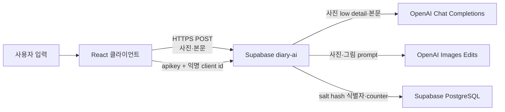

# 보안·데이터 처리

[README로 돌아가기](../README.md) · [API 명세](./api-specification.md) · [아키텍처](./architecture.md)

## 범위

이 문서는 저장소의 클라이언트, `supabase/diary-ai` Edge Function과 `supabase/sql/001_app_database.sql`에서 확인한 보안·데이터 흐름을 설명합니다. 운영 배포 일치 여부, secret·schedule과 법적 보존 정책은 `확인 필요`로 구분합니다.

## 처리 데이터

| 데이터             | 발생 위치                | 로컬 저장                                                | 외부 전송                              |
| ------------------ | ------------------------ | -------------------------------------------------------- | -------------------------------------- |
| 원본 파일          | 파일 선택·자르기 모달    | 영구 저장하지 않음                                       | 전송하지 않음                          |
| 원본을 자른 사진   | 3:2 자르기·Canvas        | draft의 1278×852 JPEG data URL                           | sketch, analyze 요청                   |
| 그림 변환 이미지   | 로컬 필터 또는 Edge 응답 | draft의 JPEG data URL                                    | 추가 전송 없음                         |
| 제목               | 작성 화면                | draft                                                    | 전송하지 않음                          |
| 본문               | 작성 화면                | draft                                                    | analyze 요청                           |
| 날짜               | 초안 생성 시 자동 확정   | draft                                                    | 전송하지 않음                          |
| 날씨               | 작성 화면                | draft                                                    | 전송하지 않음                          |
| 낮·밤 배경         | 작성 화면                | draft                                                    | 전송하지 않음                          |
| 분석 결과          | mock 또는 Edge 응답      | React 메모리 캐시                                        | 추가 전송 없음                         |
| 완성 JPEG          | Canvas                   | Toss `Storage` 또는 localStorage, 사용자가 저장하면 파일 | 앱 링크 공유 payload에는 포함하지 않음 |
| Toss 익명 key      | Toss runtime             | 앱이 별도 저장하지 않음                                  | `x-diary-client-id`                    |
| 브라우저 설치 UUID | Web Crypto               | localStorage                                             | `x-diary-client-id`                    |
| quota snapshot     | Edge 응답                | localStorage                                             | 서버에서 수신                          |
| IP                 | 네트워크 요청            | 클라이언트가 직접 저장하지 않음                          | 서버가 요청 연결에서 관찰 가능         |

## 로컬 저장소

| key                                                 | 내용                                                          | 삭제·만료                                                           |
| --------------------------------------------------- | ------------------------------------------------------------- | ------------------------------------------------------------------- |
| `summer-vacation-diary:draft:v2`                    | 초안 ID, 사진, 그림, 제목, 본문, 날짜, 날씨, 낮·밤            | OS·사용자가 앱 데이터 삭제 가능                                     |
| `summer-vacation-diary:client-id:v1`                | 무작위 브라우저 UUID                                          | 자동 만료 없음                                                      |
| `summer-vacation-diary:quota:v2`                    | 잔여량, 다음 충전, 차단·지역 상태                             | 충전 시각 경과 또는 testMode snapshot이면 삭제                      |
| `summer-vacation-diary:sketch-cache:v1`             | 원본 파일 SHA-256와 변환 그림, 최대 3개                       | 다시 그리기·캐시 교체·앱 데이터 삭제 시 제거 가능                   |
| `summer-vacation-diary:origin-storage-migration:v1` | SDK 3.x Origin 병합 완료 표시                                 | 앱 데이터 삭제 시 제거                                              |
| `summer-vacation-diary:diary-index:v1`              | 보관 id, 초안 ID, 사진·본문 hash, 날짜, 저장 시각, 제목, 날씨 | `deleteDiary`·같은 AI 입력 재저장 시 해당 항목 제거; 자동 만료 없음 |
| `summer-vacation-diary:diary:v1:<id>`               | 초안 ID, 사진·본문 hash, 본문, 완성 JPEG, AI 생성 여부        | `deleteDiary`·같은 AI 입력 재저장 시 삭제; 자동 만료 없음           |

draft는 400ms debounce와 page hide flush로 기록됩니다. 저장 용량이 부족하면 그림과 사진을 제거한 더 작은 draft로 재시도합니다.

`diary-index`와 `diary` key는 토스 앱 안에서는 localStorage가 아니라 네이티브 `Storage` 브리지에, 브라우저 개발 환경에서는 localStorage에 기록됩니다. JPEG 합성에 성공하면 자동으로 기록하고 일기 달력에서 조회·삭제합니다.

앱은 시작 시 `restoreOnStart: false`라 이전 draft를 UI에 복원하지 않지만, 저장 key 자체는 앱 데이터가 삭제될 때까지 남아 있을 수 있습니다.

SDK 3.1.1 시작 시 `Migration.getOriginStorage()`로 이전 `web.tossmini.com`과 현재 `apps.tossmini.com`의 localStorage를 조회합니다. `summer-vacation-diary:` 접두사의 key만 대상으로 하며 현재 Origin에 값이 없을 때만 이전 값을 복사합니다. 현재 값은 항상 우선하고, 조회·쓰기 실패는 앱 실행을 막지 않으며 완료 표시를 남기지 않아 다음 실행에서 다시 시도합니다. 네이티브 `Storage`, IndexedDB와 OPFS는 병합 대상이 아닙니다.

완성 일기는 이미지 없는 index와 JPEG data URL을 포함한 일기별 record로 분리해 저장합니다. 날짜별 최대 2개이며, 같은 초안 ID와 사진·본문 revision hash가 일치할 때만 기존 기록을 교체합니다. 사진 또는 본문이 달라지면 별도 기록으로 남습니다. hash는 중복 판별용이며 원본 사진을 복원하는 용도로 사용하지 않습니다. 자동 만료는 없습니다. 앱 데이터 또는 브라우저 데이터를 지우면 함께 삭제되고, 서버나 다른 기기로 동기화되지 않습니다.

## 외부 전송

Supabase가 설정된 경우:

클라이언트는 OpenAI를 직접 호출하지 않습니다. 제공된 Edge Function은 분석 시 본문과 선택 사진을 low detail image input으로 Chat Completions에 보내고, 그림 생성 시 사진과 `SKETCH_PROMPT`를 Images Edits에 보냅니다. prompt 파일 내용, OpenAI 측 보존, 운영 배포본과의 일치 여부는 제공 자료만으로 확인할 수 없습니다.

Supabase가 설정되지 않은 경우 사진·일기 내용은 외부 분석 서버로 전송하지 않고 브라우저 안에서 처리합니다.

## 동의 흐름

- 미니앱 실행 세션의 첫 사진 선택 전에 필수 처리 동의 모달을 표시합니다.
- 체크하지 않으면 파일 선택기를 열지 않습니다.
- 처리 정보, 목적, 전송·보관, 거부 결과를 안내합니다.
- 같은 실행 세션에서는 사진 교체와 새 일기 시작 시 동의 모달을 다시 표시하지 않습니다.
- 동의 여부는 React 메모리에만 유지하며, 미니앱을 새로 실행하면 다시 동의를 받습니다.
- 동의 이력, 시각, 문구 version을 영구 저장하지 않습니다.

따라서 반복 방문 또는 정책 version별 동의 증명이 요구되는 환경에서는 현재 구현만으로 충족되지 않으며 추가 설계가 필요합니다.

근거: `src/components/PhotoUploadStep.tsx`

## key와 환경 변수

클라이언트 공개:

- `VITE_SUPABASE_URL`
- `VITE_SUPABASE_PUBLISHABLE_KEY`
- `VITE_AI_TEST_MODE`

`VITE_*`는 빌드 결과에 포함됩니다. OpenAI API key, Supabase secret/service-role key를 넣으면 안 됩니다.

외부 서버 스냅샷은 `OPENAI_API_KEY`, `RATE_LIMIT_SALT`, `SUPABASE_URL`, `SUPABASE_SECRET_KEYS` 또는 legacy `SUPABASE_SERVICE_ROLE_KEY`를 필수 경로로 사용합니다. model·이미지 품질은 `OPENAI_MODEL`, `OPENAI_IMAGE_MODEL`, `OPENAI_IMAGE_QUALITY`, 운영 진단은 `DIARY_AI_DEBUG`, 서버 quota 우회는 `DIARY_AI_TEST_MODE`로 설정합니다. 이 값들은 Edge Function secret이어야 하며 `.env`의 `VITE_*`에 넣으면 안 됩니다.

## 인증과 인가

- 사용자 account authentication 없음
- 역할 기반 authorization 없음
- Supabase 요청은 publishable key를 `apikey` header로 사용
- `Authorization` header 없음
- `x-diary-client-id`는 rate limit 힌트이며 신원 인증으로 사용할 수 없음
- Edge Function은 `POST`와 `quota-status`·`inspect`·`progress-*` action, 필수 client ID와 입력 구조를 검증함
- CORS origin은 `*`여서 `https://summer-vacation-diary.apps.tossmini.com`과 `https://summer-vacation-diary.private-apps.tossmini.com`을 포함함; 운영 배포본의 별도 allowlist와 Supabase gateway JWT 설정은 확인 필요

Supabase에는 사용량 제한용 `diary_ai_rate_limits`와 익명 진행용 `diary_user_progress`, `diary_activity_days`, 마일스톤 정의용 `diary_milestones`가 있습니다. 모든 public table은 RLS를 켜고 `anon`·`authenticated`의 table 권한을 회수합니다. 브라우저는 table/RPC에 직접 접근하지 않고 Edge Function의 service role 경로만 사용합니다. 사진·제목·본문·완성 JPEG는 진행 테이블에 저장하지 않습니다.

## 입력·응답 방어

### 사진

- MIME allowlist: JPEG, PNG, WEBP
- 10MB 제한
- 디코딩 성공 확인
- 가로·세로 각각 200px 이상
- 원본 비율과 관계없이 `cover` 방식의 3:2 영역에서 이동·1~3배 확대·90° 회전
- Canvas에서 1278×852 JPEG로 재인코딩

빈 MIME type은 일부 Android picker 호환을 위해 디코딩 단계까지 허용합니다.

### 일기

- 제목 최대 15 code point
- 본문 최대 65 code point
- 공백뿐인 제목 거부
- 공백뿐인 본문 거부
- newline은 입력 시 공백으로 치환

### 분석 응답

- 배열 field type과 최대 개수 검사
- comment 필수와 50자 제한
- 첨삭·별표 대상이 본문 실제 부분 문자열인지 검사
- 비속어가 포함된 표시 대상 제외
- 알 수 없는 stamp는 `great`로 정규화
- 사용자 본문은 `dangerouslySetInnerHTML` 없이 React text로 렌더링

이 방어는 사용자 표시 안정성을 위한 클라이언트 검증이며 서버 validation을 대신하지 않습니다.

## 익명 식별과 사용량

식별자 우선순위:

1. Toss `getAnonymousKey()` → `toss:{value}`
2. localStorage의 무작위 UUID → `web:{value}`
3. 저장소 사용 불가 시 탭 메모리 UUID → `session:{value}`

클라이언트는 raw 값을 `x-diary-client-id`로 보냅니다. Edge Function은 사용자 값을 `SHA-256("user:{RATE_LIMIT_SALT}:{clientId}")`, IP를 `SHA-256("ip:{RATE_LIMIT_SALT}:{ip}")`로 변환한 뒤 RPC에 전달합니다. IP가 없으면 `unavailable:{clientId}`를 대신 사용합니다. 같은 user hash를 연속 기록에도 사용하며 `progress-delete`는 해당 진행 행과 cascade된 활동일을 삭제합니다.

quota snapshot은 UI 표시와 선차단 용도입니다. 클라이언트는 공통 `all`
카운터만 통합 AI 검사 기회로 사용합니다. 실제 강제는 `inspect` 요청을
원자적으로 차감·환불하는 서버 RPC가 담당합니다.

제목·날짜·날씨는 완성 이미지 구성에만 사용하며 외부 분석 요청에는
포함하지 않습니다. 따라서 이 세 값만 수정한 경우 기존 분석 결과를
그대로 사용하고 검사 기회를 추가로 소진하지 않습니다.

서버 사용량 집계 구조는 [ERD](./erd.md)에 정리되어 있습니다.

진행 snapshot은 기기에 cache되며, 서버 완료 호출 실패 시 `summer-vacation-diary:progress-pending-completion:v1`에 한국 날짜만 잠시 기록합니다. 같은 날 앱 복귀 시 재시도하고 날짜가 바뀌면 폐기합니다. Supabase 미설정 개발 모드에서는 `summer-vacation-diary:progress-local:v1`에 활동 날짜 배열을 저장합니다.

## 저장과 공유

- 토스 저장 시 data URL prefix를 제거한 JPEG Base64를 `saveBase64Data`에 전달합니다.
- 브라우저 저장은 `<a download>`를 사용합니다.
- 공유는 완성 이미지가 아니라 앱 소개 문구와 Toss share link 또는 현재 URL입니다.
- 일기 상세의 `저장 및 공유`에서 실행하는 이미지 저장은 공개 URL 업로드가 아니라 같은 JPEG 파일 저장/다운로드 경로를 사용합니다.
- 공개 이미지 URL을 만들거나 사진을 업로드하는 공유 서버는 없습니다.
- 브라우저 Clipboard fallback은 현재 페이지 URL만 복사합니다.

제공된 서버는 사용자별 AI 검사 기회를 최대 2개 저장하고 매일 09:00 KST에 1개 충전합니다. IP 20회/10분·100회/UTC day, sketch 150회/UTC day, analyze 250회/UTC day 보호 제한은 유지합니다. 확인 가능한 국가가 `KR`이 아니면 차단하고, 국가 header가 없으면 허용합니다. 실패 시 `content-blocked`, `invalid-image`, `invalid-input`, `invalid-content`만 차감을 유지하고 그 밖의 오류는 사용자 기회와 해당 보호 counter 환불을 시도합니다.

## 확인이 필요한 서버 항목

- [ ] 저장소 Edge Function·SQL과 실제 배포 version의 일치
- [ ] 서버 측 요청 body 크기·MIME 상한 추가 여부
- [ ] prompt 내용과 운영 배포 version의 일치
- [ ] 사진·본문·응답·로그의 저장 여부와 보존 기간
- [ ] hash counter 행의 삭제·보존 정책과 salt rotation 절차
- [ ] rate-limit 정리 RPC의 주기 schedule과 hash 보존 기간
- [ ] Supabase가 국가 header를 실제로 전달하는지
- [ ] wildcard CORS와 Supabase gateway JWT 설정
- [ ] incident 대응·공개 보안 신고 채널

## 저장소의 보안 운영 상태

- `SECURITY.md` 없음
- dependency 취약점 검사 workflow 없음
- secret scanning 또는 SAST workflow 없음
- 공개 보안 신고 주소 없음
- GitHub Actions secret은 Discord webhook 하나이며 merge 알림 job에서만 사용

위 항목은 이 저장소에 포함되지 않은 운영 확인 항목입니다. 배포 전에 실제 서비스 설정과 운영 환경에서 확인해야 합니다.

## 관련 문서

- [API 명세](./api-specification.md)
- [ERD](./erd.md)
- [기능 명세](./functional-specification.md)
- [배포](./deployment.md)
